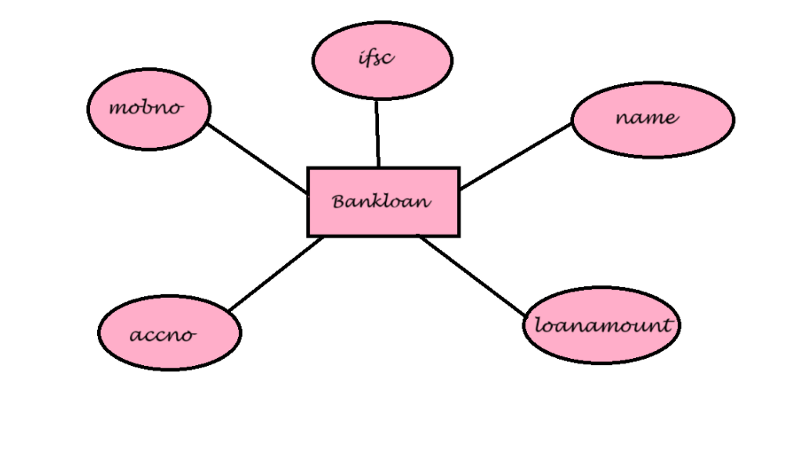

# Ex02 Django ORM Web Application
## Date: 27/10/24

## AIM
To develop a Django application to store and retrieve data from a bank loan database using Object Relational Mapping(ORM).

## ENTITY RELATIONSHIP DIAGRAM



## DESIGN STEPS

### STEP 1:
Clone the problem from GitHub

### STEP 2:
Create a new app in Django project

### STEP 3:
Enter the code for admin.py and models.py

### STEP 4:
Execute Django admin and create details for 10 books

## PROGRAM
```
models.py
from django.db import models
from django.contrib import admin
class Bankloan(models.Model):
   name=models.CharField(max_length=100)
   ifsc=models.CharField(max_length=30)
   mobno=models.IntegerField()
   accno=models.IntegerField(primary_key="accno")
   loanamount=models.IntegerField()

class BankloanAdmin(admin.ModelAdmin):
 list_display=('name','ifsc','mobno','accno','loanamount')
admin.py
from django.contrib import admin
from.models import Bankloan,BankloanAdmin
admin.site.register(Bankloan,BankloanAdmin)


```
## OUTPUT

Include the screenshot of your admin page.


## RESULT
Thus the program for creating a database using ORM hass been executed successfully
